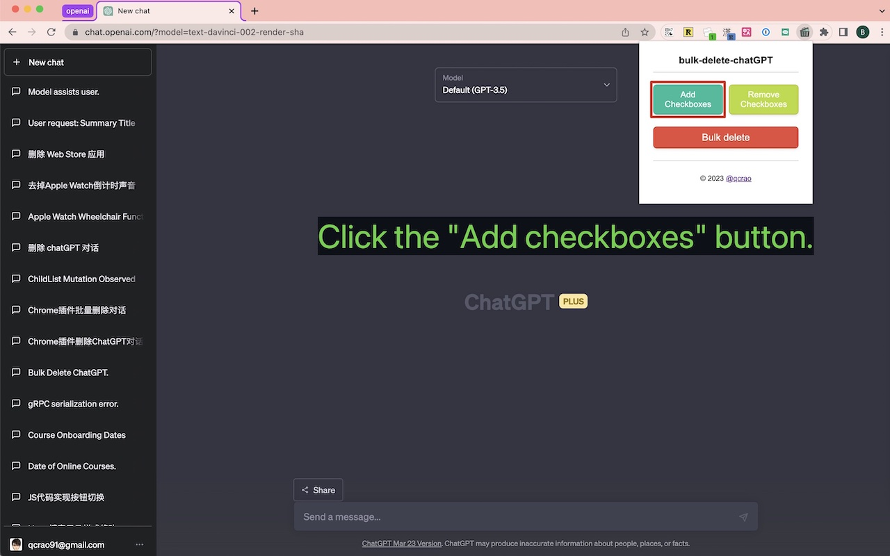
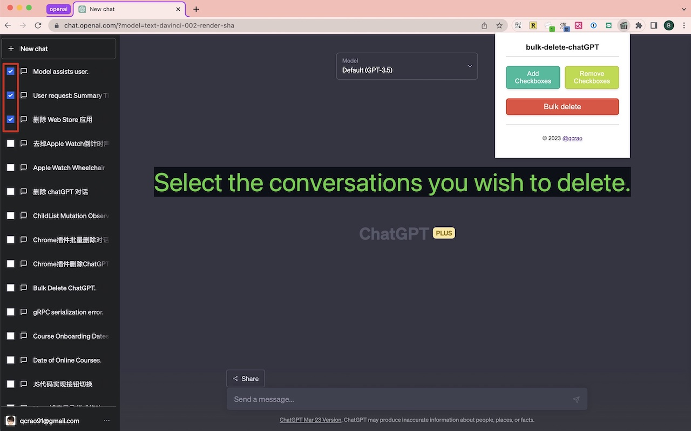
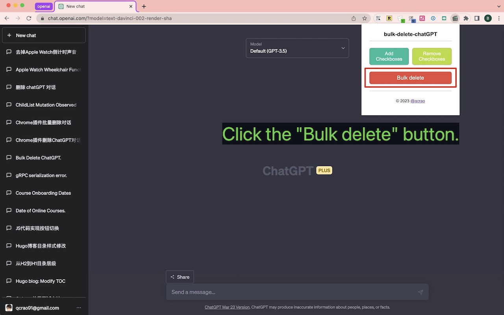

# bulk-delete-chatGPT

# 项目介绍

bulk-delete-chatGPT 是一个 Chrome 扩展程序，用于批量删除 ChatGPT 页面上的对话。使用此扩展程序可以快速、轻松地管理 ChatGPT 页面上的对话。它包含一个简洁的用户界面，提供了一种高效的方式来执行批量删除对话操作。

# 截图

<table>
  <tr>
    <td></td>
    <td></td>
    <td></td>
  </tr>
</table>

# 使用说明

- 访问 Chrome 网上应用商店中的 [ChatGPT Bulk Delete](https://chrome.google.com/webstore/detail/chatgpt-bulk-delete/effkgioceefcfaegehhfafjneeiabdjg) 页面。
- 点击 "添加至Chrome" 按钮以安装扩展程序。
- 打开 [ChatGPT 网站页面](https://chat.openai.com/)。
- 点击浏览器右上角的 bulk-delete-chatGPT 扩展程序图标。
- 点击 "添加复选框"按钮。扩展会自动地在 ChatGPT 页面左侧的每个对话前添加一个复选框。
- 选中你想删除的对话。
- 点击 "批量删除"按钮，选中的对话将被删除。
- 如有需要，您可以点击 "去掉复选框" 按钮来隐藏复选框。
