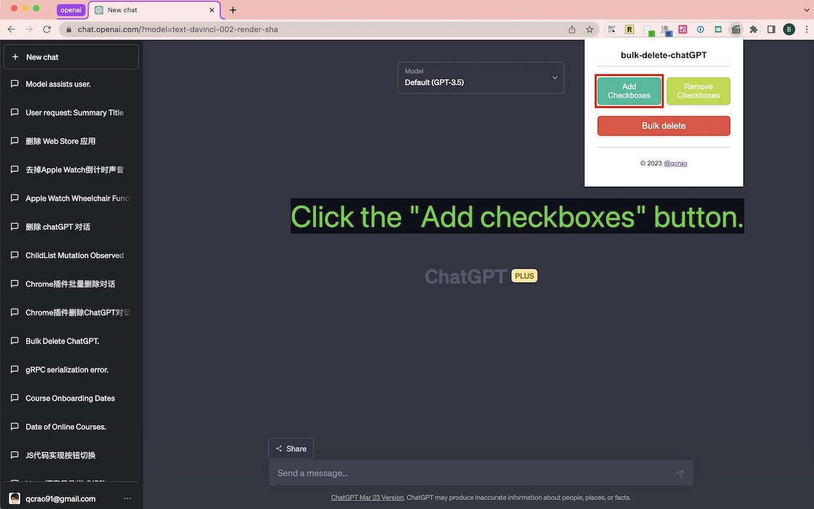
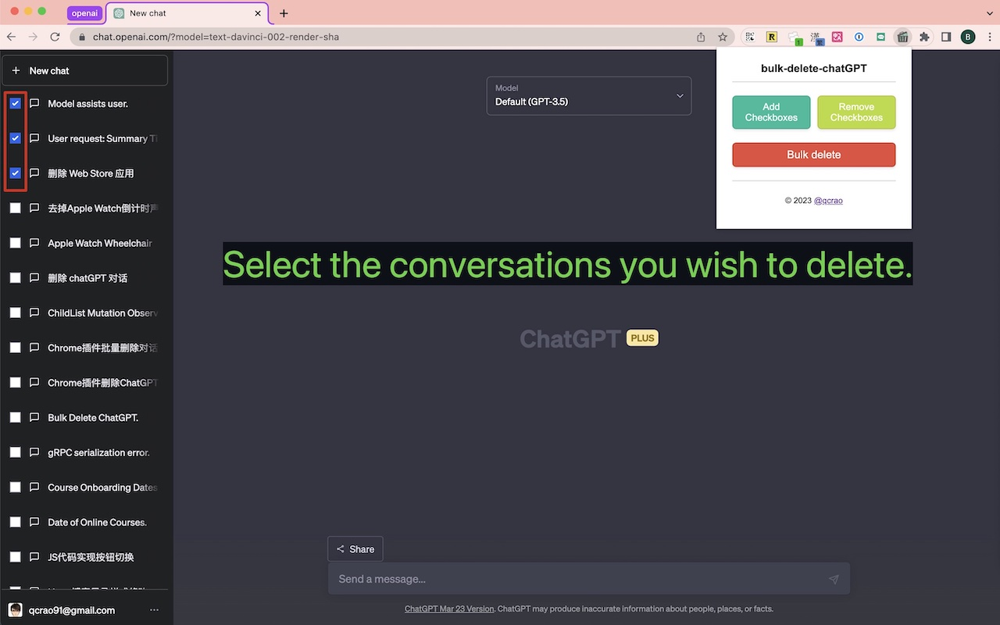
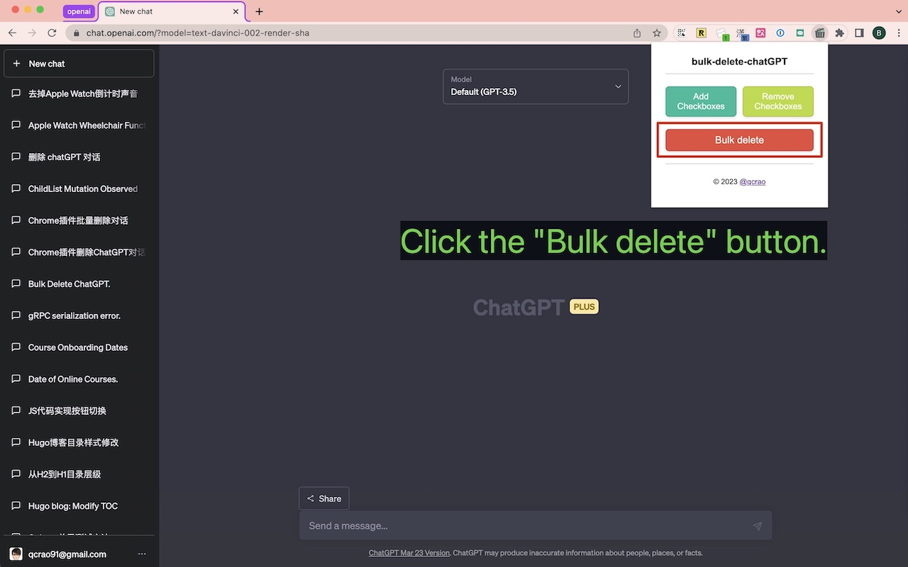

# [🌟Ads：TubeVocab-Learn English with Youtube Videos](https://www.tubevocab.com)

# bulk-delete-chatGPT

English | [中文版本](./README-CN.md)

## Project Introduction

`bulk-delete-chatGPT` is an extension designed to bulk-delete conversations on ChatGPT pages. This extension allows you to quickly and easily manage conversations on ChatGPT pages. It features a clean and intuitive user interface, providing an efficient way to perform bulk deletion of conversations.

## Screenshot

<table>
  <tr>
    <td></td>
    <td></td>
    <td></td>
  </tr>
</table>

## Installation
### Chrome:

- Go to the [ChatGPT Bulk Delete Chrome extension page](https://chrome.google.com/webstore/detail/chatgpt-bulk-delete/effkgioceefcfaegehhfafjneeiabdjg) in the Chrome Web Store.
- Click the "Add to Chrome" button to install the extension.

### Firefox:
- Go to the [ChatGPT Bulk Delete Firefox extension page](https://addons.mozilla.org/en-US/firefox/addon/chatgpt-bulk-delete)
- Click the "Add to Firefox" button to install the extension.

## Usage Instructions
- Open the [ChatGPT website page](https://chat.openai.com/).
- Click the `bulk-delete-chatGPT` extension icon in the top-right corner of your browser.
- Click the "Add checkboxes" button. The extension will automatically add a checkbox in front of each conversation on the ChatGPT page.
- Select the conversations you wish to delete.
- Click the "Bulk delete" button, and the selected conversations will be deleted.
- If needed, you can click the "Remove checkboxes" button to hide the checkboxes.
- It's possible to select all checkboxes between your last selection and the one being selected by holding shift.